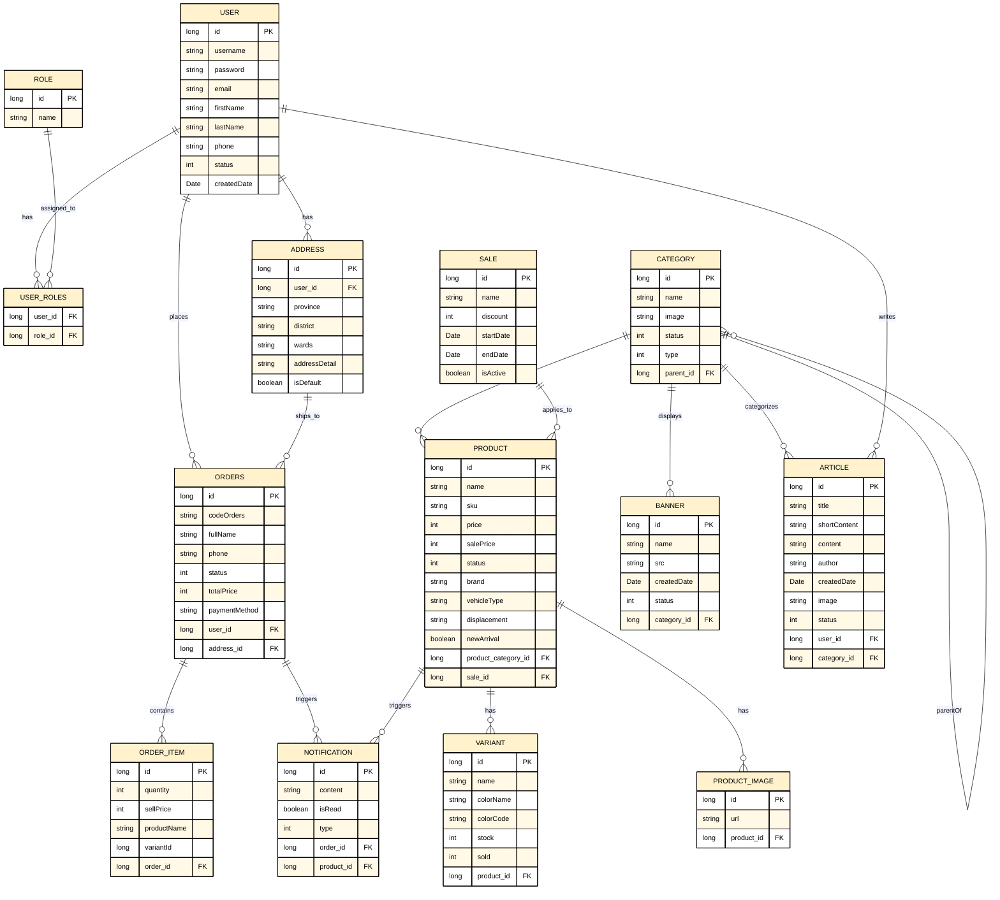

# Sơ đồ ERD - Cơ sở dữ liệu MotoShop (Phiên bản Thẩm mỹ)

Dưới đây là sơ đồ ERD chính xác được ánh xạ trực tiếp từ các entity JPA trong mã nguồn Java của backend (`MotoShop_BE`). 

Sơ đồ này đã được thiết kế lại để:
1. **Khắc phục các lỗi logic của ảnh cũ:** Loại bỏ bảng lặp, nối dây chính xác đến các khóa ngoại thực tế.
2. **Đẹp và gọn gàng hơn:** Sử dụng giao diện màu vàng kem (`#FFF2CC`) chủ đạo, viền đen và chữ đen tối giản giống hệt phong cách gọn gàng của ảnh cũ trước đây.

